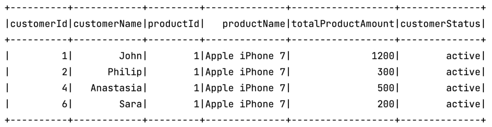
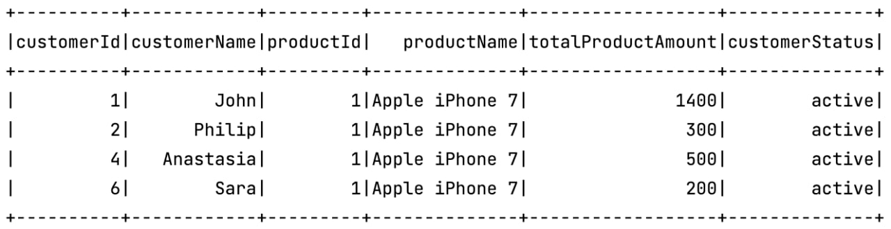
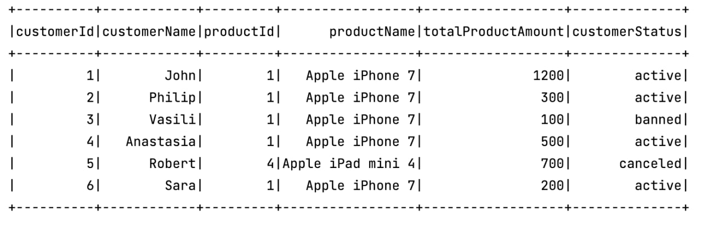
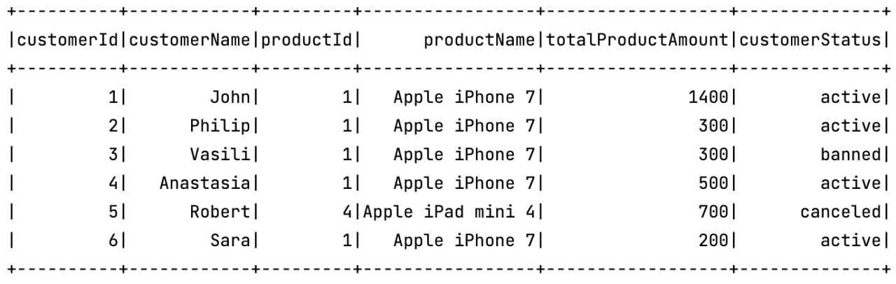
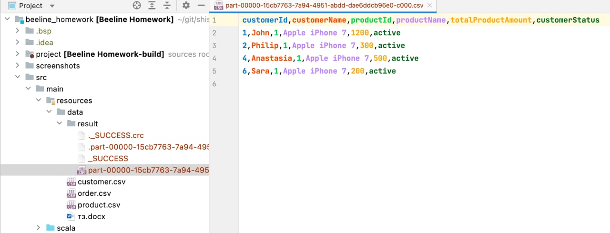

# Beeline Homework

## Входные данные
**Customer.csv** – информация о клиентах\
id: Int,\
name: String,\
email: String,\
joinDate: Date,\
status: String\
\
**Product.csv** – информация о товарах\
id: Int\
name: String\
price: Double\
numberOfProducts: Int\
\
**Order.csv** – информация о заказах\
customerID: Int\
orderID: Int\
productID: Int\
numberOfProduct: Int – кол-во товара в заказе\
orderDate: Date\
status: String\
\
Необходимо определить самый популярный продукт у клиента\
Итоговое множество содержит поля: customer.name, product.name\
Результат записать в файл\

## Параметры программы

Класс для запуска вычислений - **com.beeline.homework.shishkin.SparkApplication**.\
Исходные данные лежат в папке **src/main/resources/data/**.\
Файл с результатами вычислений будет записан по этому же пути в подпапку **results**.\
Доменные объекты:\
**case class Customer** - кейс класс для исходных данных из файла customer.csv\
**case class Product** - кейс класс для исходных данных из файла product.csv\
**case class Order** - кейс класс для исходных данных из файла order.csv\
**case class MostPopularProduct** - кейс класс для аггрегированных данных по самым популярным продуктам покупателя\
**case class MostPopularProductWithDetails** - кейс класс для аггрегированных данных по самым популярным продуктам покупателя с добавленными
значениями: имя продукта, имя покупателя, статус покупателя.\
Бизнес логика расположена в пакете **com.beeline.homework.shishkin.business**\

**Флаг OnlyDeliveredOrders** - если значение установлено в true, то заказы будут отфильтрованы. В итоговой выборке останутся заказы со статусом "delivered".\
**Флаг OnlyActiveCustomers** - если значение установлено в true, то в итоговой выборке останутся заказы только для покупателей со статусом "active".\

## Скриншоты результатов вычислений
**OnlyDeliveredOrders = true**\
**OnlyActiveCustomers = true**

**OnlyDeliveredOrders = false**\
**OnlyActiveCustomers = true**

**OnlyDeliveredOrders = true**\
**OnlyActiveCustomers = false**

**OnlyDeliveredOrders = false**\
**OnlyActiveCustomers = false**

**Пример содержимого результирующего csv файла который был сгенерирован с параметрами OnlyDeliveredOrders = true и OnlyActiveCustomers = true**
